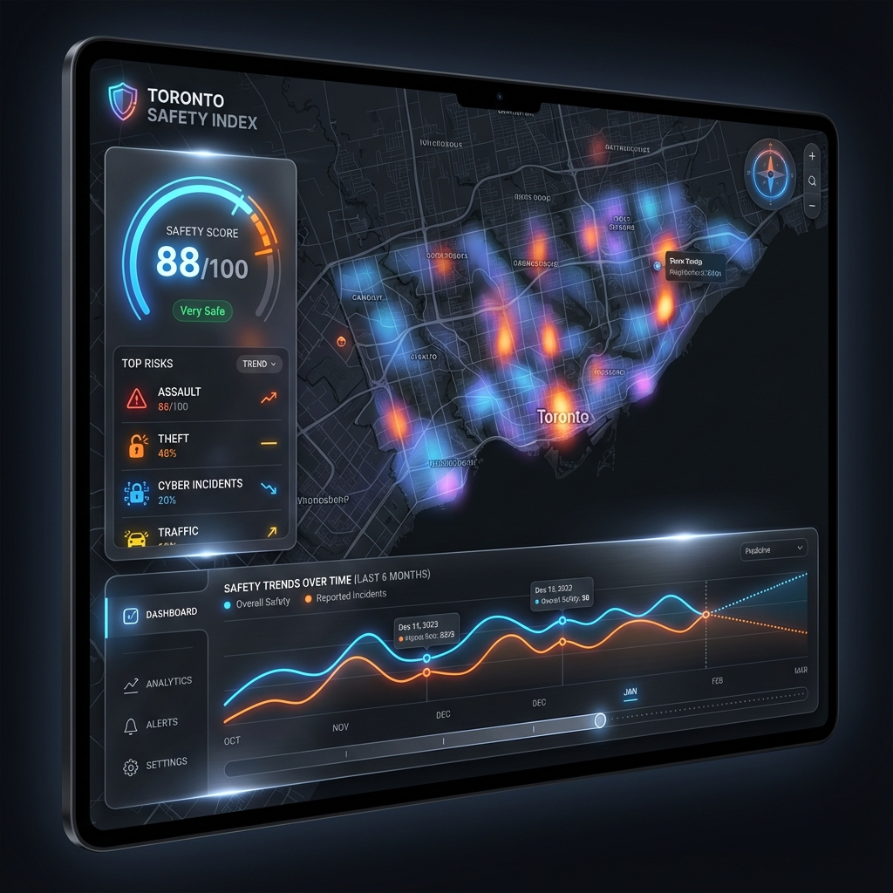
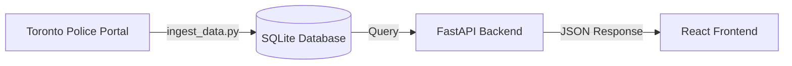

# 🛡️ Toronto Safety Index

> **A premium, real-time safety analytics platform for Toronto.**
> *Powered by Advanced Geospatial Analysis & Machine Learning.*



## 📖 Overview

The **Toronto Safety Index** is a sophisticated full-stack application that quantifies public safety across the city. Unlike simple crime maps, it uses a **grid-based benchmarking engine** to calculate a normalized "Safety Score" (0-100) for any location, backed by 10 years of historical data.

It features a **premium React frontend** for interactive exploration and a **FastAPI backend** that handles complex geospatial queries, trend forecasting, and live data ingestion.

---

## 🏗️ Architecture

The system is built on a modern, scalable stack designed for performance and ease of use.



### Core Components

1.  **Backend (`/`)**: FastAPI (Python) server handling scoring logic, spatial indexing, and forecasting.
2.  **Frontend (`/client`)**: React + Vite application with a glassmorphism design system.
3.  **Data Engine (`/data`)**: Automated pipeline to fetch, clean, and ingest 10+ crime datasets.

---

## 🚀 Getting Started

### Prerequisites
*   Python 3.9+
*   Node.js 16+

### 1. Backend Setup

The backend handles data ingestion and serves the API.

```bash
# 1. Install Python dependencies
pip install fastapi uvicorn pandas numpy scikit-learn statsmodels requests pgeocode

# 2. Initialize Database & Download Data
# This script fetches the latest data from the Toronto Police Service and builds the DB.
python3 ingest_data.py --download

# 3. Start the API Server
python3 main.py
```
*Server runs at `http://localhost:8001`*

### 2. Frontend Setup

The frontend is a modern React application.

```bash
cd client

# 1. Install dependencies
npm install

# 2. Start Development Server
npm run dev
```
*App runs at `http://localhost:5173`*

---

## 🔌 API Documentation

The backend exposes a RESTful API for querying safety data.

### `GET /score`

Calculates the safety score and provides detailed insights for a specific postal code.

**Parameters:**
*   `pincode` (string): The Toronto postal code (e.g., `M5V2T6`).

**Example Request:**
```bash
curl "http://localhost:8001/score?pincode=M5V2T6"
```

**Full Response Example:**

The API returns a rich JSON object containing the calculated score, historical trends, category breakdowns, and AI-driven insights.

```json
{
  "pincode": "M5V2T6",
  "coordinates": {
    "lat": 43.6404,
    "lon": -79.3995
  },
  "current_score": 8.3,
  "overall_percentile": 99.0,
  "history": [
    {
      "year": "2025",
      "safety_score": 7.8,
      "incident_count": 631
    },
    {
      "year": "2024",
      "safety_score": 5.5,
      "incident_count": 890
    },
    {
      "year": "2023",
      "safety_score": 5.8,
      "incident_count": 903
    },
    {
      "year": "2022",
      "safety_score": 6.6,
      "incident_count": 786
    },
    {
      "year": "2021",
      "safety_score": 6.6,
      "incident_count": 820
    }
  ],
  "category_breakdown": {
    "Assault": {
      "safety_score": 8.2,
      "category_percentile": 99.0,
      "incident_count": 327,
      "city_avg_incidents": 33,
      "trend": "Up",
      "weighted_impact": 4511.4,
      "top_subtypes": [
        { "type": "Assault", "count": 234 },
        { "type": "Assault With Weapon", "count": 44 },
        { "type": "Assault Bodily Harm", "count": 18 }
      ]
    },
    "Robbery": {
      "safety_score": 40.5,
      "category_percentile": 94.7,
      "incident_count": 15,
      "city_avg_incidents": 5,
      "trend": "Up",
      "weighted_impact": 137.0,
      "top_subtypes": [
        { "type": "Robbery With Weapon", "count": 5 },
        { "type": "Robbery - Other", "count": 4 }
      ]
    },
    "Break and Enter": {
      "safety_score": 6.0,
      "category_percentile": 99.2,
      "incident_count": 88,
      "city_avg_incidents": 11,
      "trend": "Up",
      "weighted_impact": 645.1,
      "top_subtypes": [
        { "type": "B&E", "count": 73 },
        { "type": "B&E W'Intent", "count": 13 }
      ]
    },
    "Auto Theft": {
      "safety_score": 56.5,
      "category_percentile": 86.7,
      "incident_count": 23,
      "city_avg_incidents": 15,
      "trend": "Up",
      "weighted_impact": 126.8,
      "top_subtypes": [
        { "type": "Theft Of Motor Vehicle", "count": 23 }
      ]
    },
    "Theft Over": {
      "safety_score": 8.7,
      "category_percentile": 98.9,
      "incident_count": 26,
      "city_avg_incidents": 4,
      "trend": "Up",
      "weighted_impact": 93.7,
      "top_subtypes": [
        { "type": "Theft Over", "count": 15 },
        { "type": "Theft From Motor Vehicle Over", "count": 9 }
      ]
    },
    "Theft From Motor Vehicle": {
      "safety_score": 4.4,
      "category_percentile": 99.5,
      "incident_count": 82,
      "city_avg_incidents": 11,
      "trend": "Up",
      "weighted_impact": 225.0,
      "top_subtypes": [
        { "type": "Theft From Motor Vehicle Under", "count": 82 }
      ]
    },
    "Bicycle Theft": {
      "safety_score": 6.5,
      "category_percentile": 99.2,
      "incident_count": 73,
      "city_avg_incidents": 3,
      "trend": "Up",
      "weighted_impact": 134.7,
      "top_subtypes": [
        { "type": "THEFT UNDER - BICYCLE", "count": 48 },
        { "type": "THEFT UNDER", "count": 22 }
      ]
    }
  },
  "insights": {
    "safety_clock": [62, 80, 80, 83, 80, 64, 78, 78, 66, 74, 63, 52, 60, 67, 63, 53, 64, 54, 31, 34, 16, 0, 12, 44],
    "monthly_pattern": [33, 0, 30, 28, 9, 14, 18, 5, 9, 100, 98, 32],
    "weekly_pattern": [10.5, 11.2, 13.3, 9.9, 6.6, 5.8, 7.5],
    "peak_hour": "9pm",
    "peak_time_range": "20:00-23:00",
    "primary_risk": "Assault",
    "neighbourhood": "Wellington Place (164)",
    "premises_breakdown": {
      "Outside": 250,
      "Apartment": 203,
      "Commercial": 123,
      "Other": 42,
      "House": 8
    }
  },
  "temporal_breakdown": {
    "day_safety_score": 9.9,
    "night_safety_score": 7.3
  },
  "risk_tags": {
    "negative": [
      "High Crime Area",
      "High Assault",
      "High Robbery",
      "High Break and Enter",
      "High Theft Over",
      "High Theft From Motor Vehicle",
      "High Bicycle Theft"
    ],
    "positive": []
  },
  "benchmark": {
    "city_percentile": 91,
    "city_average_score": 50,
    "status": "Very Low Safety"
  },
  "forecast": {
    "predicted_score": 5.5,
    "trend_direction": "Declining",
    "model_used": "Seasonal Decomp",
    "rmse": 0.2,
    "confidence_interval": "±0.4"
  }
}
```

---

## 📂 Project Structure

| File | Description |
| :--- | :--- |
| **`ingest_data.py`** | **The Backbone.** Handles downloading CSVs from the police portal, cleaning them, and building the `crime_data.db` database. |
| **`main.py`** | **The Entrypoint.** Defines the FastAPI routes and connects the frontend to the backend logic. |
| **`scoring.py`** | **The Brain.** Contains the `calculate_score` algorithm, spatial queries, and percentile ranking logic. |
| **`forecasting.py`** | **The Oracle.** Implements the forecasting engine to predict future safety trends. |
| **`generate_grid_benchmarks.py`** | **The Benchmark.** Generates the 31,350 grid points used to normalize scores across the city. |
| **`benchmarks.json`** | **The Reference.** Stores the pre-calculated score distribution for fast percentile lookups. |
| **`metadata.json`** | **The Ledger.** Tracks the date ranges and last refresh time for all datasets. |
| **`client/`** | **The Face.** Contains the complete React frontend source code. |

---

## 📊 Data Sources

Data is sourced directly from the [Toronto Police Service Public Safety Data Portal](https://data.torontopolice.on.ca/).

*   Shooting & Firearm Discharges
*   Homicides
*   Assault
*   Auto Theft
*   Break & Enter
*   Robbery
*   Theft Over / From Motor Vehicle
*   Bicycle Thefts

*Last Refreshed: Automatically tracked in `metadata.json`*
